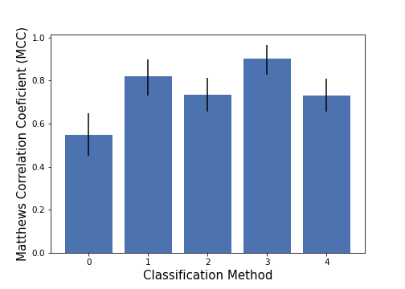

# DA-Detection

## Description
Computed tomography (CT) is one of the most common medical imaging modalities in radiation oncology and radiomics research, the computational voxel-level analysis of medical images. Radiomics is vulnerable to the effects of dental artifacts (DA) caused by metal implants or fillings and can hamper future reproducibility on new datasets. In this study we seek to better understand the robustness of quantitative radiomic features to DAs. Furthermore, we propose a novel method of detecting DAs in order to safeguard radiomic studies and improve reproducibility.

This project contains an analysis of PyRadiomic features extracted from the RADCURE CT image set. We then provide an automated DA detection algorithm which uses a signogram-based detection method (SBD) combined with a convolutional neural network (CNN). Finally, we include an iterative algorithm to detect the location of the axial slice containing the DA in a 3D CT scan.


## Usage
### Setup
To download all requirements, clone the repository:
```
$ git clone https://github.com/bhklab/DA-Detection.git
```

Then, create a conda environment with the required packages:
```
$ conda env create -f environment.yml
```

### PyRadiomic Feature Analysis
The analysis of PyRadiomic features can be found in a jupyter notebook located in `analysis/radiomic_feature_analysis.ipynb`.

### Running CNN and SBD Classifiers
The `classify_images.py` script should be used to run each classifier. This script should be called from the command line with options for which classifier to use. For example, to classify all data with the sinogram-based detection (SBD) algorithm, type
```
python classify_images.py --sbd_only --ncpu=75
```
Similarly, to run only the CNN on one GPU, use
```
python classify_images.py --cnn_only --on_gpu
```
The default behaviour (without any arguments) of `classify_images.py` is to run both models on all the data consecutively on one CPU and no GPUs.

## Results
The results of the classifier are calculated in `analysis/performance_assessment.ipynb`. The labels and predicted classifications of the images are output to `results/`. The combined SBD and CNN hybrid algorithm performed as well as human annotators for 3-class DA classification.


